<p align="center">
  
</p>

<p align="center">
  
  
  
  
</p>

<p align="center">
  <b>Tuli</b> keeps our Discord server fun, safe and in the loop:<br>
  quotes, points, levels, a shop, daily questions and trivia, scam protection, and ISU news.
</p>

<p align="center">
  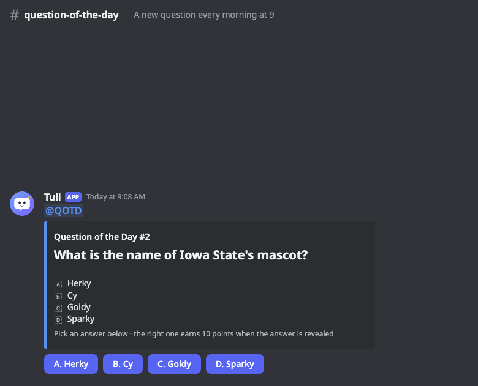
</p>

---

## Contents

1. [What Tuli does](#what-tuli-does)
2. [Get started](#get-started): create the bot, run it, invite it
3. [Set up your server](#set-up-your-server)
4. [Feature guides](#feature-guides): [Quotes](#-quotes) · [Points](#-points) · [Levels](#-levels) · [Shop](#%EF%B8%8F-shop) · [Questions](#-questions-and-trivia) · [Scam protection](#%EF%B8%8F-scam-protection) · [Feeds](#-isu-news-feeds)
5. [Command reference](#command-reference)
6. [Keeping Tuli online](#keeping-tuli-online)
7. [Troubleshooting](#troubleshooting)
8. [For developers](#for-developers)

---

## What Tuli does

|                  | For members                                                | For staff                                                       |
| ---------------- | ---------------------------------------------------------- | --------------------------------------------------------------- |
| 💬 **Quotes**    | Save funny moments and pull up a random one                | Remove any quote                                                |
| 🪙 **Points**    | Daily rewards with streaks, send points to friends         | Reward people, e.g. for coming to a GBM                         |
| 🏆 **Levels**    | Earn XP by chatting, level up, climb the leaderboard       | Hand out roles at certain levels                                |
| 🛍️ **Shop**      | Spend points on roles and prizes                           | Sell roles (automatic) or prizes you deliver, like trivia hints |
| ❓ **Questions** | Answer the question of the day, play trivia, vote in polls | Queue questions and choose when they post                       |
| 🛡️ **Safety**    | Scams get cleaned up automatically                         | Scam reports with one-click ban; warnings and purge             |
| 📰 **Feeds**     | ISU news and opportunities posted in a channel             | Follow any website's RSS feed, filtered by keywords             |

Type **`/tuli`** in Discord any time to see every command you can use. Each one is clickable:

<p align="center">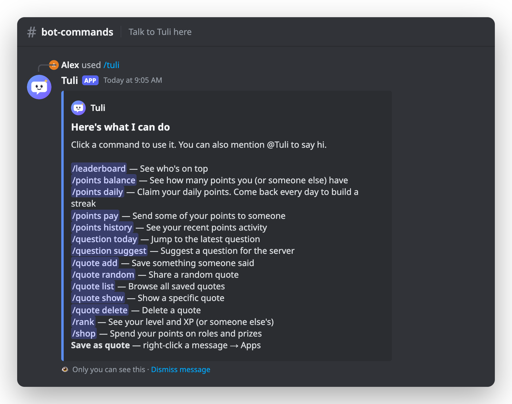</p>

> [!NOTE]
> The pictures in this guide are drawn from Tuli's real code: a script runs each command against a pretend server and draws what Tuli sends, the way Discord shows it. See [Updating the pictures](#updating-the-pictures).

---

## Get started

Setting Tuli up takes about 15 minutes. You'll need:

- A computer with [Node.js 22 or newer](https://nodejs.org) (check with `node --version`)
- A Discord server where you have **Manage Server** permission. Make a private test server first if you can.

### Step 1: Create the bot on Discord

1. Open the [Discord Developer Portal](https://discord.com/developers/applications) and click **New Application**. Name it `Tuli`.
2. In the **Installation** tab:
   - Set **Install Link** to **None**, then **Save**. Discord won't let you make the bot private until you do this.
   - Under **Installation Contexts**, uncheck **User Install** and keep **Guild Install** checked.
3. In the **Bot** tab:
   - Click **Reset Token** and copy the token. **Treat it like a password.** Anyone who has it can control your bot.
   - Turn off **Public Bot**, so only you can add Tuli to servers.
   - Under **Privileged Gateway Intents**, turn on **Message Content Intent**. Scam protection needs it to read messages.
   - Optional: set the bot's icon to  [`docs/images/tuli-avatar.png`](docs/images/tuli-avatar.png).

### Step 2: Download and run Tuli

```sh
git clone https://github.com/ethanpam/Tuli.git
cd Tuli
npm install
cp .env.example .env     # then open .env and paste your token after DISCORD_TOKEN=
npm run dev
```

You should see:

```text
Logged in as Tuli#1234 (in 0 servers)
Invite link: https://discord.com/oauth2/authorize?client_id=...
Registered 10 commands
```

`npm run dev` restarts Tuli whenever you change a file. Leave it running.

### Step 3: Invite Tuli to your server

Open the **Invite link** from the terminal, pick your server, and click **Authorize**. The link asks for every permission Tuli needs. If you add features later, open it again to update them.

### Step 4: Say hi

Mention Tuli in any channel. If it answers, you're connected:

<p align="center">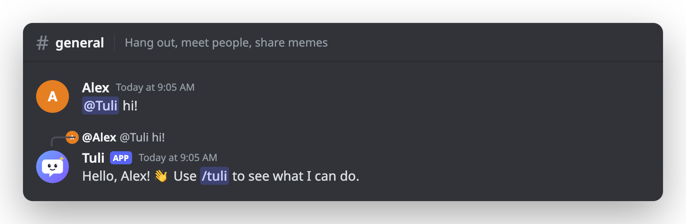</p>

> [!TIP]
> If Tuli's commands don't show up when you type `/`, reload Discord with <kbd>Ctrl</kbd>+<kbd>R</kbd> (<kbd>Cmd</kbd>+<kbd>R</kbd> on Mac).

---

## Set up your server

Do these once, in order. Everything here is under **`/admin`**, which only people with **Manage Server** can see.

- [ ] **Move Tuli's role up.** In **Server Settings → Roles**, drag **Tuli** above your members' roles and above any role Tuli should hand out.
- [ ] **Pick a staff channel:** `/admin setup log-channel channel:#staff-log`. Scam reports, shop orders and question suggestions arrive there.
- [ ] **Set your timezone** if you're not on Central time: `/admin setup timezone`. Daily rewards reset and questions post in this timezone.
- [ ] **Check everything:** `/admin setup overview`. If Tuli is missing a permission, click **Update Tuli's permissions**.

> [!IMPORTANT]
> Discord only lets a bot time out members and give roles that sit **below** its own role. This is the most common reason for "Tuli couldn't give the role".

<p align="center">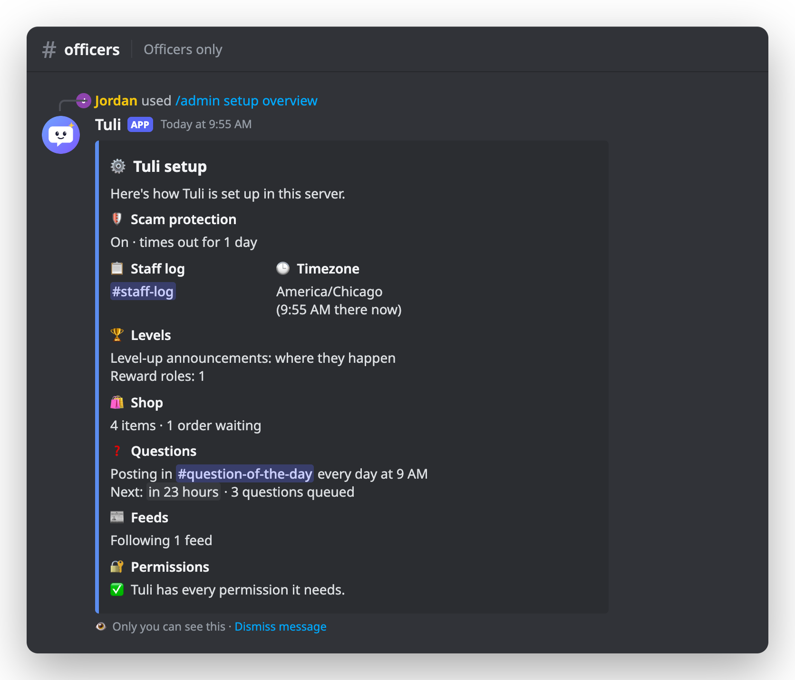</p>

Then turn on the features you want. Each guide below explains how.

---

## Feature guides

### 💬 Quotes

Save the funny things people say, then bring them back later.

<p align="center">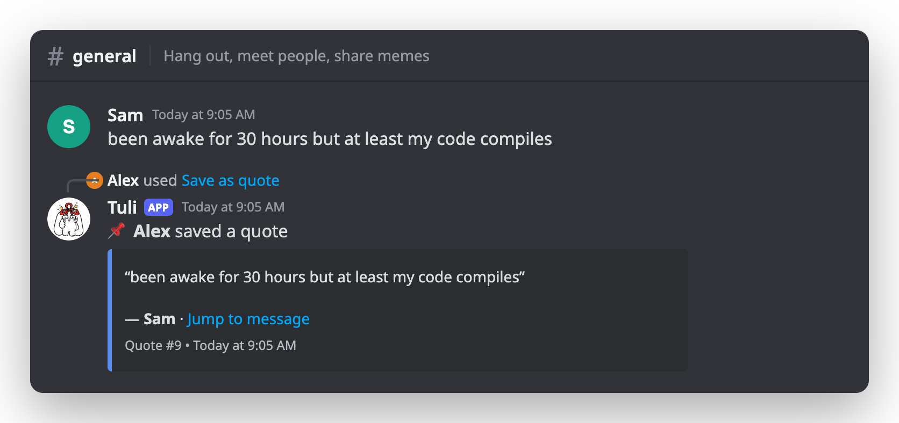</p>

**How to use it**

- **Save a message:** right-click it (long-press on mobile) → **Apps** → **Save as quote**. The quote links back to the original message.
- **Save something said out loud:** `/quote add text:"..." by:@someone`
- **Share one:** `/quote random`, or `/quote random by:@someone`
- **Browse all of them:** `/quote list`, 10 per page. Only you see the list, so browsing doesn't flood the channel.

<p align="center">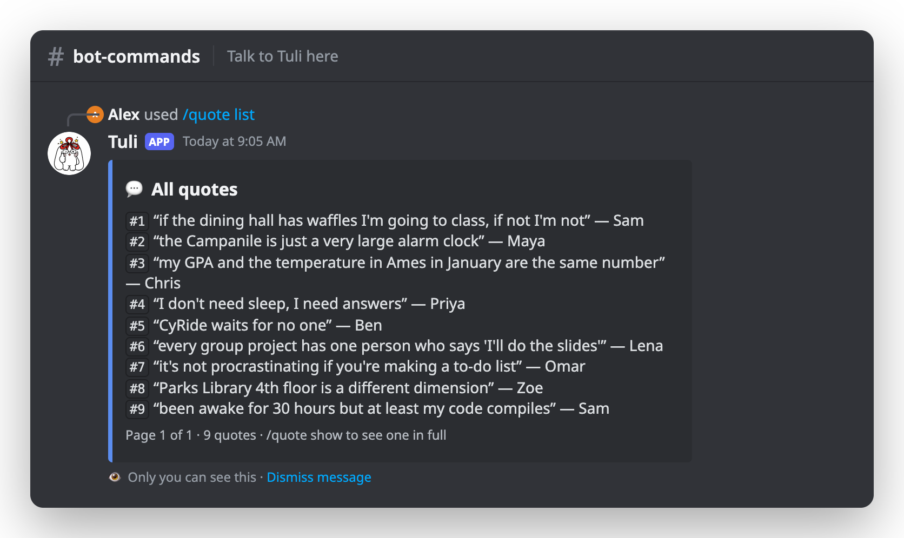</p>

**Good to know:** quotes are numbered per server (#1, #2...). Tuli won't save the same thing from the same person twice, ignoring capitalization, spacing and quote marks. A quote can be deleted with `/quote delete` by the person who saved it, the person quoted, or a moderator.

### 🪙 Points

Points are the server's currency. Members earn them by showing up, and spend them in the [shop](#%EF%B8%8F-shop).

<p align="center">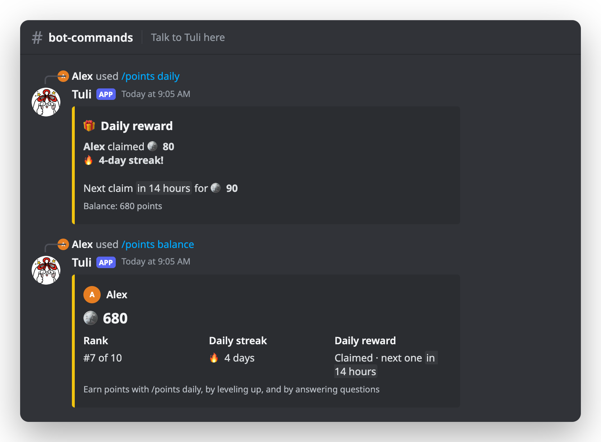</p>

| How to earn                                                            | Points                                            |
| ---------------------------------------------------------------------- | ------------------------------------------------- |
| `/points daily` (once a day, in your timezone)                         | 50, then 10 more for each day in a row, up to 100 |
| Reaching a new level                                                   | 20 × the level (level 5 → 100)                    |
| Answering a question (first answer, poll vote, or right trivia answer) | 10                                                |
| Staff: `/admin points give member amount reason`                       | Any amount                                        |

Members can send points to each other with `/points pay`, and see every change and its reason with `/points history`. Staff can see anyone's history with `/admin points history`. Balances always add up, because every change is recorded and purchases happen all-or-nothing.

> [!TIP]
> Reward GBM attendance: `/admin points give member:@Alex amount:50 reason:Came to the October GBM`. The member gets a shout-out, and it's logged in your staff channel.

### 🏆 Levels

Chatting earns XP. Levels come with bonus points, and optionally roles.

<p align="center">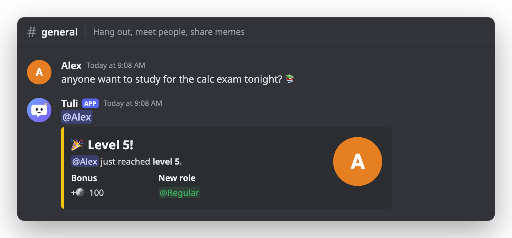</p>

<table>
  <tr>
    <td width="50%">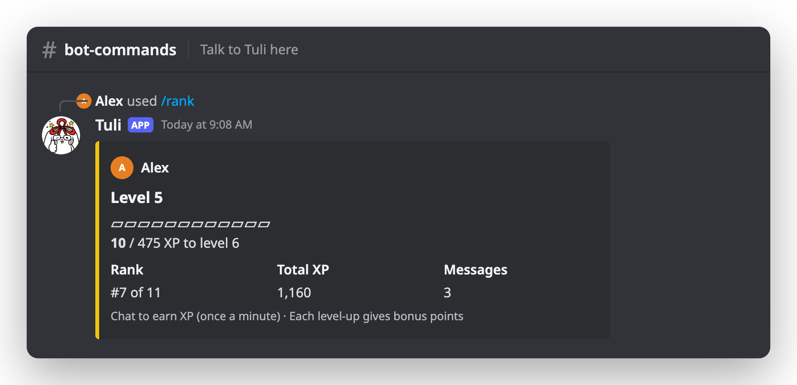</td>
    <td width="50%">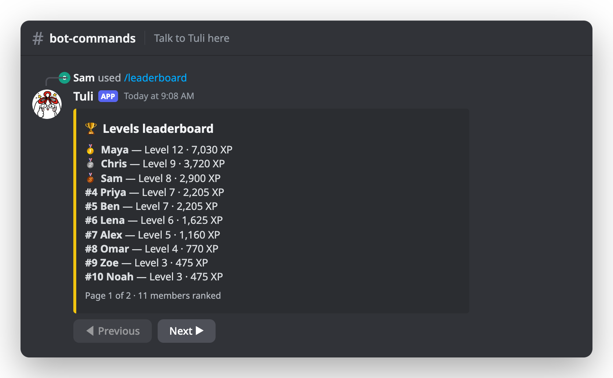</td>
  </tr>
  <tr>
    <td align="center"><code>/rank</code></td>
    <td align="center"><code>/leaderboard</code></td>
  </tr>
</table>

- Each message earns **15–25 XP**, at most **once a minute**, so spamming doesn't help.
- Levels follow the same curve as MEE6 (100 XP for level 1, then 155, 220, 295...), so you can carry levels over with `/admin levels set`.
- **Reward roles:** `/admin levels reward level:5 role:@Regular`. People already past level 5 get the role right away. Members keep every reward role they earn.
- **Announcements:** `/admin levels announcements` posts them where they happen (the default), in one channel, or not at all.

### 🛍️ Shop

Members spend points on things you offer. There are two kinds of items:

- **Roles**, handed out automatically, like a "Trivia Champ" role.
- **Prizes staff deliver**, like trivia hints, stickers, or picking the next GBM snack.

<p align="center">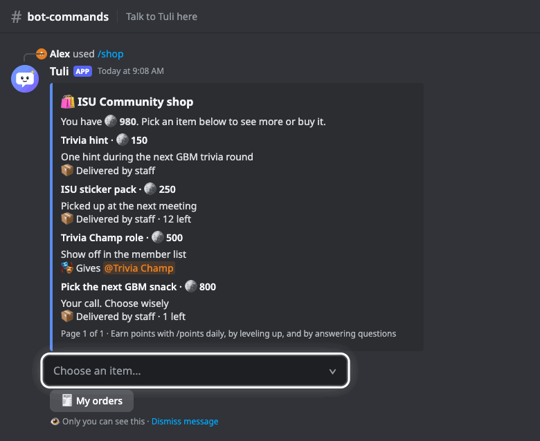</p>

**Add items:**

```text
/admin shop add name:Trivia hint price:150 description:One hint during the next GBM trivia round
/admin shop add name:Trivia Champ role price:500 role:@Trivia Champ
/admin shop add name:ISU sticker pack price:250 stock:12
```

When someone buys a prize, an order card appears in your staff channel. Click **Mark delivered** once you've handed it over, or **Refund** to give their points back. Either way, the member gets a DM.

<p align="center">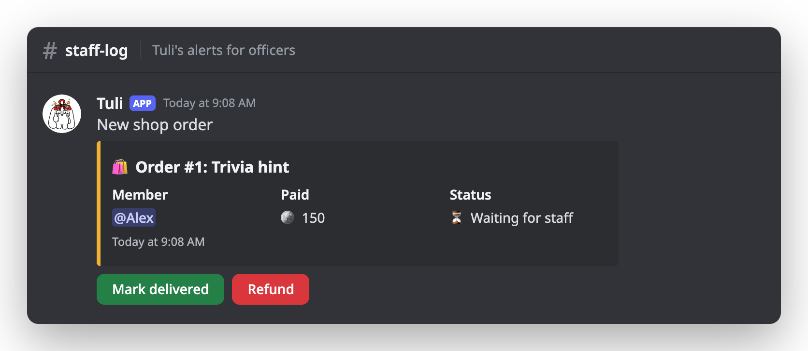</p>

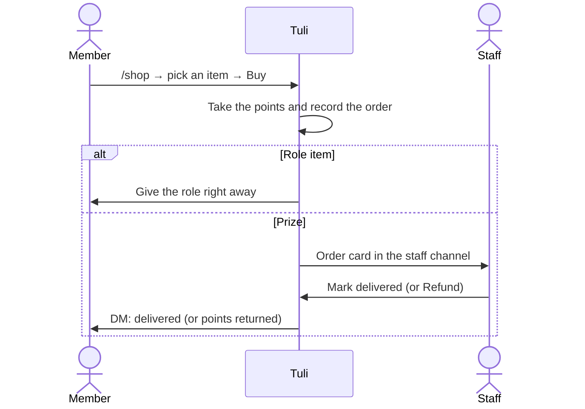
```mermaid
sequenceDiagram
    actor M as Member
    participant T as Tuli
    actor S as Staff
    M->>T: /shop → pick an item → Buy
    T->>T: Take the points and record the order
    alt Role item
        T->>M: Give the role right away
    else Prize
        T->>S: Order card in the staff channel
        S->>T: Mark delivered (or Refund)
        T->>M: DM: delivered (or points returned)
    end
```

> [!NOTE]
> Tuli won't sell roles with staff powers (like Administrator or Manage Messages), so nobody can buy their way into moderation. If Tuli can't give a role someone bought, it refunds them and tells your staff channel why.

### ❓ Questions and trivia

Tuli posts a question on a schedule. You choose the kind:

| Kind                | Add it with                      | How people answer              | Points                                           |
| ------------------- | -------------------------------- | ------------------------------ | ------------------------------------------------ |
| **Open question**   | `/admin questions add`           | In the question's thread       | 10 for their first answer                        |
| **Multiple choice** | `/admin questions add-choice`    | Buttons (A–E); answers lock in | 10 for the right answer, paid when it's revealed |
| **Poll**            | `add-choice`, with no `answer`   | Buttons                        | 10 for voting                                    |
| **True/false**      | `/admin questions add-truefalse` | True / False buttons           | 10 for the right answer, paid when it's revealed |

<table>
  <tr>
    <td width="50%">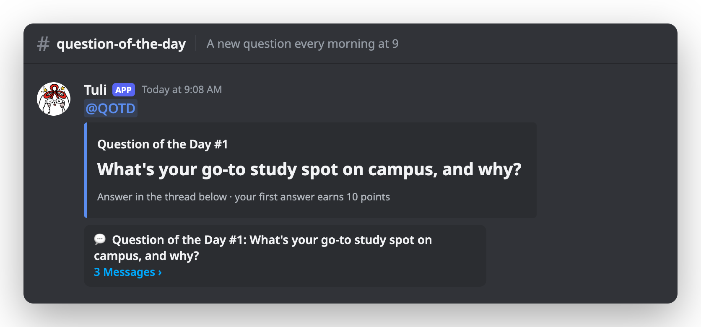</td>
    <td width="50%">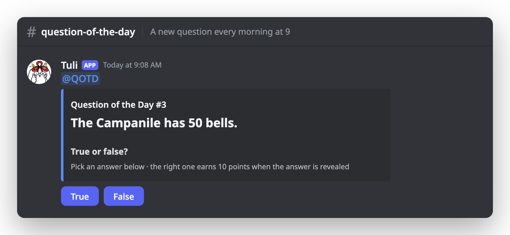</td>
  </tr>
  <tr>
    <td align="center">Open question with its answer thread</td>
    <td align="center">True/false</td>
  </tr>
</table>

**Set it up:**

1. Add a few questions:
   ```text
   /admin questions add question:What's your go-to study spot on campus, and why?
   /admin questions add-choice question:What is the name of Iowa State's mascot? choice-a:Herky choice-b:Cy choice-c:Goldy choice-d:Sparky answer:B
   /admin questions add-truefalse statement:The Campanile has 50 bells. answer:True
   ```
2. Pick when and where: `/admin questions schedule channel:#question-of-the-day frequency:Every day hour:9 AM ping:@QOTD`
3. Check what's coming up with `/admin questions queue`. Questions post oldest first.

**When the answer is revealed:** buttons stay open until the next question posts, or until you run `/admin questions close`. Then the post shows how everyone voted, marks the right answer, and Tuli announces it:

<p align="center">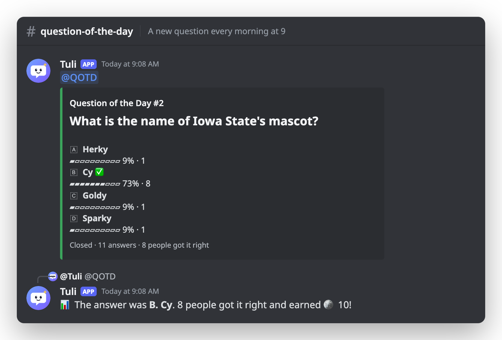</p>

The right answer stays hidden until then, so nobody can pass it around.

> [!TIP]
> **Trivia night at a GBM:** queue your questions ahead of time. During the meeting, run `/admin questions post-now` to show the next one. Give people a minute, then run `/admin questions close` to reveal the answer. Repeat for each round.

Members can suggest questions with `/question suggest`. Suggestions arrive in your staff channel with **Add to queue** / **Reject** buttons. If Tuli was offline when a question was due, it posts once when it's back, not once per missed day, and it warns staff when the queue is almost empty.

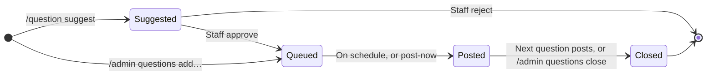
```mermaid
stateDiagram-v2
    direction LR
    [*] --> Suggested: /question suggest
    Suggested --> Queued: Staff approve
    Suggested --> [*]: Staff reject
    [*] --> Queued: /admin questions add…
    Queued --> Posted: On schedule, or post-now
    Posted --> Closed: Next question posts, or /admin questions close
    Closed --> [*]
```

### 🛡️ Scam protection

Hacked accounts love student servers: "free Nitro" links, fake Steam sites, and "I'm giving away my MacBook, DM me". Tuli catches them automatically.

<p align="center">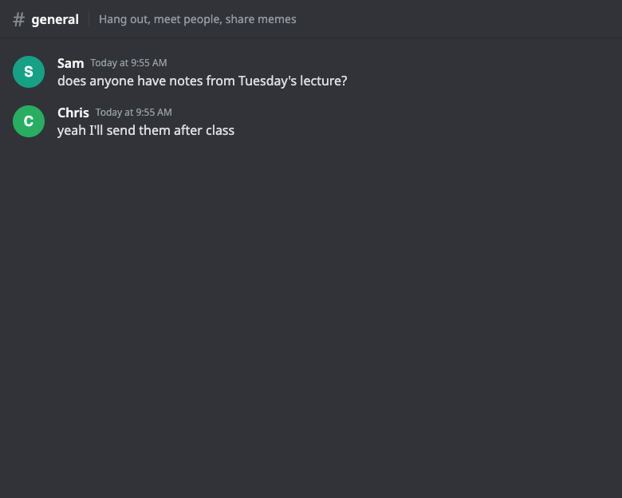</p>

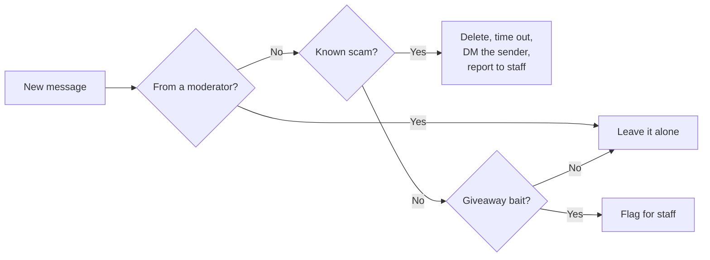
```mermaid
flowchart LR
    A[New message] --> B{From a moderator?}
    B -- Yes --> OK[Leave it alone]
    B -- No --> C{Known scam?}
    C -- Yes --> D["Delete, time out,<br/>DM the sender,<br/>report to staff"]
    C -- No --> E{Giveaway bait?}
    E -- Yes --> F[Flag for staff]
    E -- No --> OK
```

**Known scams**, which Tuli deletes right away:

- links to fake Discord or Steam sites (`dlscord.gift`, `steamcommunlty.com`...)
- "free Nitro" or Steam gift bait with a link
- `@everyone` with a link, from someone who can't ping everyone
- the same message posted in 3+ channels within a minute, which is how hacked accounts spread

**Giveaway bait** ("giving away my MacBook / selling tickets, DM me") is only flagged, with **Delete & time out** and **Looks fine** buttons, because real students post things like that too.

<table>
  <tr>
    <td width="50%">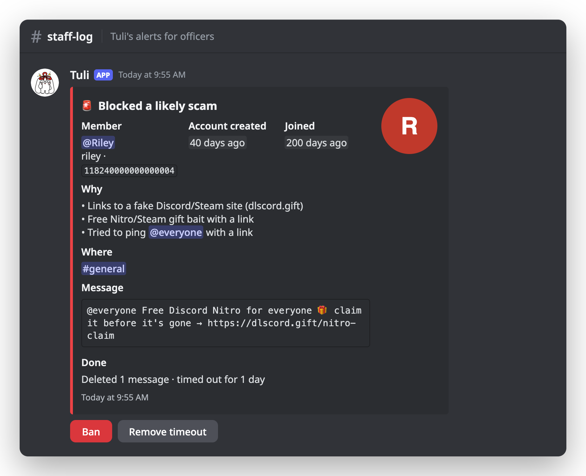</td>
    <td width="50%">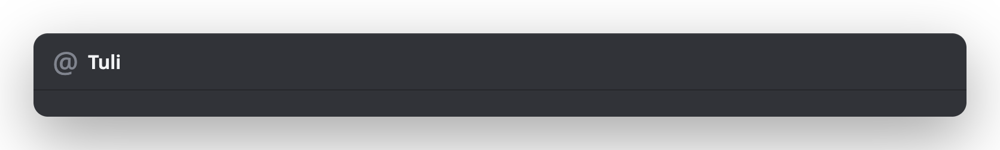</td>
  </tr>
  <tr>
    <td align="center">What staff see</td>
    <td align="center">What the sender gets</td>
  </tr>
</table>

- **Ban** asks you to confirm first, so a misclick can't ban anyone.
- Change the timeout (or turn protection off) with `/admin protection configure`. The default is on, with a 1-day timeout.
- Test a message without posting it: `/admin protection test message:free nitro https://dlscord.gift/x`
- Moderators (anyone with **Manage Messages**) are never checked.

Moderators also get **`/mod warn`** (the member gets a DM, and it's kept on record), **`/mod warnings`**, **`/mod unwarn`** and **`/mod purge`** (bulk-delete recent messages, optionally from one person).

### 📰 ISU news feeds

Tuli follows websites' RSS feeds and posts new items in a channel. It's good for ISU news, events and opportunities.

<p align="center">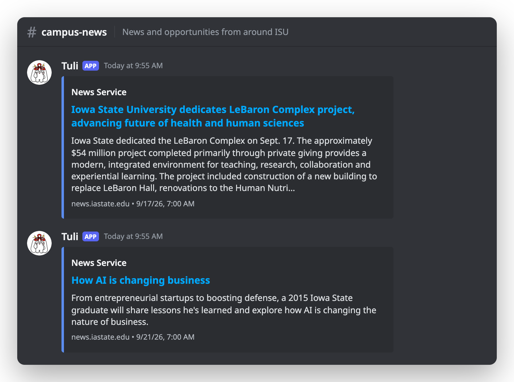</p>

```text
/admin feeds add url:https://www.news.iastate.edu/rss.xml channel:#campus-news
/admin feeds add url:https://www.career.iastate.edu/feed/ channel:#opportunities keywords:internship, scholarship, research, hiring
```

| Feed                    | Link                                        |
| ----------------------- | ------------------------------------------- |
| ISU News                | `https://www.news.iastate.edu/rss.xml`      |
| Inside Iowa State       | `https://www.inside.iastate.edu/rss.xml`    |
| Iowa State Daily        | `https://iowastatedaily.com/feed/`          |
| Career Services         | `https://www.career.iastate.edu/feed/`      |
| College of Engineering  | `https://www.engineering.iastate.edu/feed/` |
| Liberal Arts & Sciences | `https://www.las.iastate.edu/feed/`         |

Tuli checks every 10 minutes and posts at most 5 items at a time. When you add a feed, only posts from then on are shared, so the channel isn't flooded with old news. Use `/admin feeds preview` to see how a feed's posts will look. If a feed breaks, your staff channel hears about it once. Other sites: WordPress sites usually have a feed at `/feed/`, and Drupal sites at `/rss.xml`.

---

## Command reference

<details open>
<summary><b>Everyone</b></summary>

| Command                                              | What it does                                |
| ---------------------------------------------------- | ------------------------------------------- |
| `/tuli`                                              | See everything Tuli can do                  |
| `@Tuli`                                              | Tuli says hi                                |
| `/quote add` · `random` · `list` · `show` · `delete` | Save, share and browse quotes               |
| Right-click a message → Apps → **Save as quote**     | Save that message as a quote                |
| `/points balance` · `daily` · `pay` · `history`      | Check, earn and send points                 |
| `/rank [member]`                                     | Level, XP progress, rank and message count  |
| `/leaderboard [board]`                               | Top members by level or points              |
| `/shop`                                              | Browse and buy, and check your orders       |
| `/question today` · `suggest`                        | Jump to the latest question, or suggest one |

</details>

<details>
<summary><b>Moderators</b> (Moderate Members permission)</summary>

| Command                      | What it does                                         |
| ---------------------------- | ---------------------------------------------------- |
| `/mod warn member reason`    | Warn someone; they get a DM, and it's kept on record |
| `/mod warnings member`       | See someone's warnings                               |
| `/mod unwarn id`             | Remove a warning                                     |
| `/mod purge amount [member]` | Bulk-delete recent messages in this channel          |

</details>

<details>
<summary><b>Admins</b> (Manage Server permission)</summary>

| Command                                                                      | What it does                                         |
| ---------------------------------------------------------------------------- | ---------------------------------------------------- |
| `/admin setup overview` · `log-channel` · `timezone`                         | Check setup and permissions; staff channel; timezone |
| `/admin points give` · `take` · `history`                                    | Adjust points with a reason; see anyone's history    |
| `/admin levels reward` · `remove-reward` · `rewards`                         | Roles given at certain levels                        |
| `/admin levels announcements` · `set`                                        | Where level-ups are announced; set someone's level   |
| `/admin shop add` · `edit` · `remove` · `orders`                             | Manage items, prices, stock and orders               |
| `/admin questions schedule` · `pause` · `post-now` · `close`                 | When questions post; post or reveal right away       |
| `/admin questions add` · `add-choice` · `add-truefalse` · `queue` · `remove` | Manage the question queue                            |
| `/admin protection configure` · `test`                                       | Scam protection settings, or test a message          |
| `/admin feeds add` · `list` · `remove` · `preview`                           | Follow websites' RSS feeds                           |

Server owners can change who may use `/admin` or `/mod` in **Server Settings → Integrations → Tuli**.

</details>

---

## Keeping Tuli online

Tuli is only online while it's running. On a laptop, that stops when the laptop sleeps. To keep it up around the clock, run it on something that's always on.

**An always-on computer** (a Raspberry Pi, an old laptop, or a small VPS):

```sh
git clone https://github.com/ethanpam/Tuli.git && cd Tuli
npm ci --omit=dev
cp .env.example .env                       # paste your token
npx pm2 start npm --name tuli -- start     # keeps it running, restarts it if it crashes
npx pm2 save && npx pm2 startup            # starts it again after a reboot
```

**A hosting service** (Railway, Fly.io, Render...):

1. Set the `DISCORD_TOKEN` environment variable. A `.env` file isn't needed.
2. Use `npm start` as the start command.
3. Attach a **persistent volume** and set `DATABASE_PATH` to a file on it, e.g. `/data/tuli.db`.

> [!WARNING]
> Without persistent storage, every redeploy wipes all points, quotes and levels. And run only **one** copy of Tuli at a time, or it will answer everything twice.

**Backups:** all of Tuli's data is in one file (`data/tuli.db` unless you set `DATABASE_PATH`). Stop Tuli, copy the file, and start it again.

---

## Troubleshooting

<details>
<summary><b>Commands don't show up when I type <code>/</code></b></summary>

Reload Discord with <kbd>Ctrl</kbd>+<kbd>R</kbd> (<kbd>Cmd</kbd>+<kbd>R</kbd>). Check that the terminal said `Registered 10 commands`. If Tuli was invited without the `applications.commands` scope, open the invite link it prints and authorize again.

</details>

<details>
<summary><b>"Tuli couldn't give the role" / timeouts don't work</b></summary>

In **Server Settings → Roles**, drag Tuli's role above the role it's giving and above the members it moderates. `/admin setup overview` lists the roles that are affected.

</details>

<details>
<summary><b>The terminal says "Message Content Intent is turned off"</b></summary>

Tuli is running without scam detection. Go to the [Developer Portal](https://discord.com/developers/applications) → your app → **Bot** → turn on **Message Content Intent**, then restart Tuli.

</details>

<details>
<summary><b>"An invalid token was provided"</b></summary>

The token in `.env` is wrong or was reset. Get a new one from the **Bot** tab (**Reset Token**) and paste it after `DISCORD_TOKEN=`, with no quotes or spaces.

</details>

<details>
<summary><b>Questions aren't posting</b></summary>

Run `/admin setup overview`. The Questions section shows whether posting is paused, when the next question is due, whether the queue is empty, and whether Tuli is missing permissions in the channel.

</details>

<details>
<summary><b>Tuli answers everything twice</b></summary>

Two copies are running with the same token, for example on your laptop and on a server. Stop one.

</details>

<details>
<summary><b>Tuli is offline</b></summary>

It's only online while `npm run dev` or `npm start` is running. See [Keeping Tuli online](#keeping-tuli-online).

</details>

---

## For developers

### How it fits together

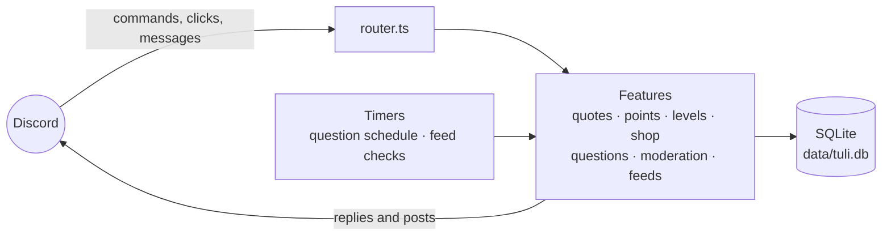
```mermaid
flowchart LR
    D((Discord)) -- "commands, clicks, messages" --> R[router.ts]
    R --> F["Features<br/>quotes · points · levels · shop<br/>questions · moderation · feeds"]
    F --> DB[("SQLite<br/>data/tuli.db")]
    F -- replies and posts --> D
    T["Timers<br/>question schedule · feed checks"] --> F
```

Every part of Tuli is a **feature**: one folder in `src/features/` that declares its commands, buttons, `/admin` subcommands, the permissions it needs, and its lines in `/admin setup overview`. The router sends each interaction to the right feature. Staff-only subcommands from every feature are gathered into `/admin`.

```text
src/
  index.ts          Connects to Discord and starts everything
  router.ts         Sends each command, button and message to the right feature
  db.ts             The database and its migrations
  settings.ts       Per-server settings
  ui.ts             Colors, notices and pagination shared by every feature
  features/
    index.ts        The list of features
    <feature>/      store.ts (database) and index.ts (commands and screens)
test/               Tests, including end-to-end ones against a pretend Discord server
docs/tools/         The script that draws this guide's pictures
```

### Commands

| Command               | What it does                                                 |
| --------------------- | ------------------------------------------------------------ |
| `npm run dev`         | Run with auto-restart on file save                           |
| `npm start`           | Run once                                                     |
| `npm run check`       | Typecheck, test and check formatting (run before committing) |
| `npm run format`      | Format the code                                              |
| `npm run docs:images` | Redraw the pictures in `docs/images`                         |

### Adding a feature

1. Create `src/features/<name>/index.ts` exporting a `Feature` (see `src/types.ts`).
2. Add it to the list in `src/features/index.ts`. Its commands, buttons, `/admin` subcommands, permissions and overview lines are picked up automatically.
3. Add database tables as a **new entry at the end** of the migrations list in `src/db.ts`. Never edit an entry that has already run: running bots apply migrations as soon as they start.
4. Add tests in `test/`. `test/support/fake-discord.ts` lets a test run real commands and clicks end to end.

### Updating the pictures

The screenshots and animations in `docs/images` come from `npm run docs:images`. It runs Tuli's real commands against an example server (`docs/tools/scenes.ts`), draws each channel the way Discord's dark theme shows it, and saves PNGs and GIFs with Chrome. It needs Google Chrome installed; set `CHROME_PATH` if Chrome isn't in the usual place. Run it after changing how anything looks, and commit the new images.
